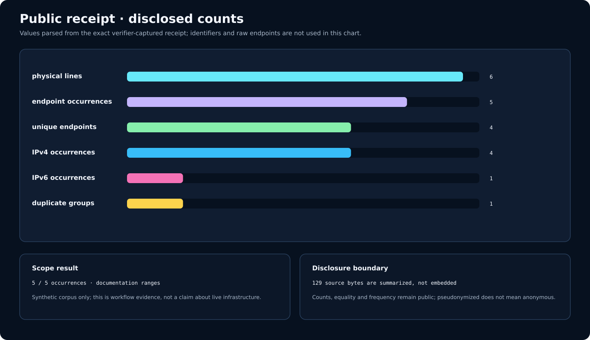
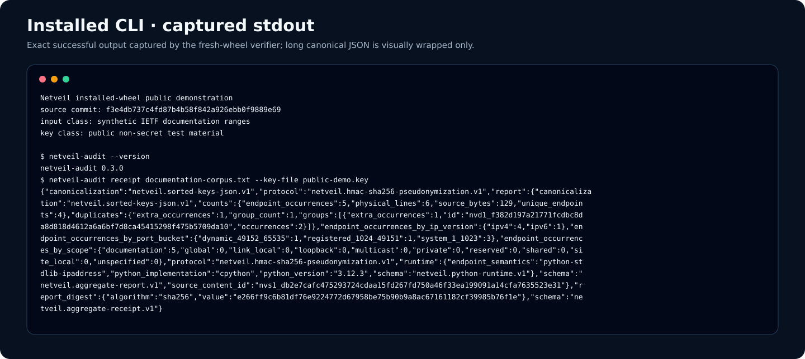
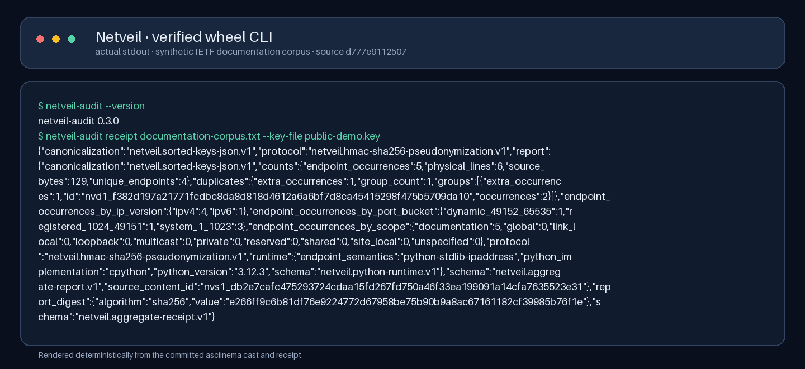
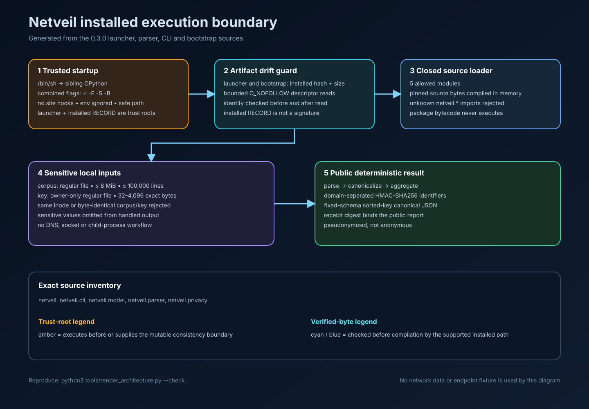
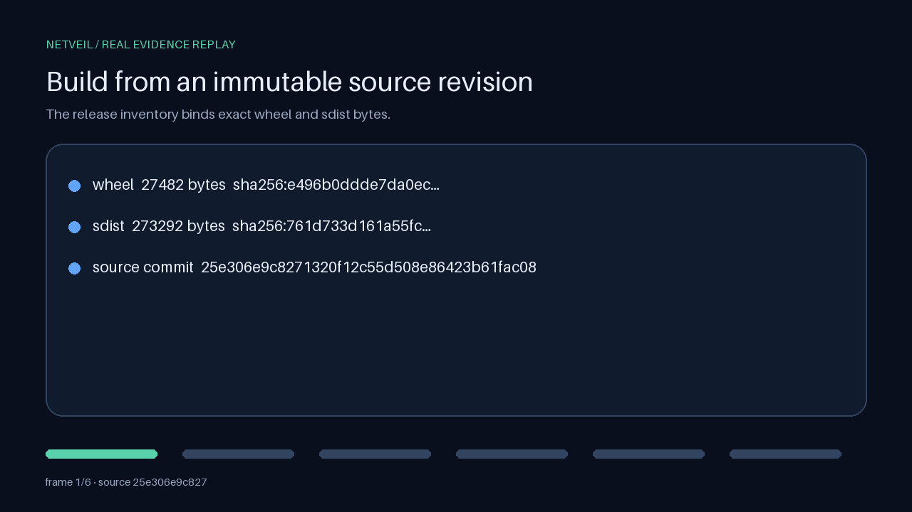
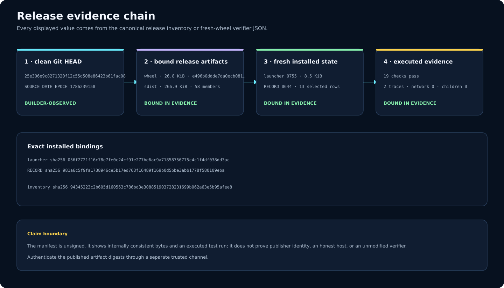
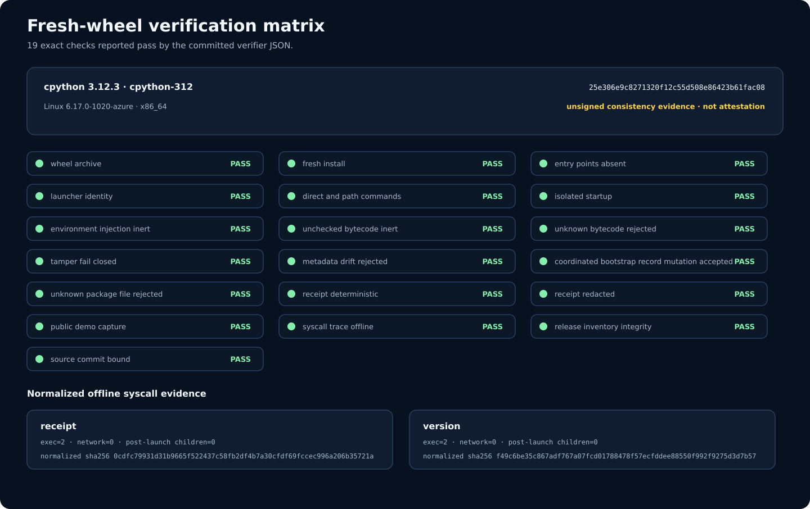
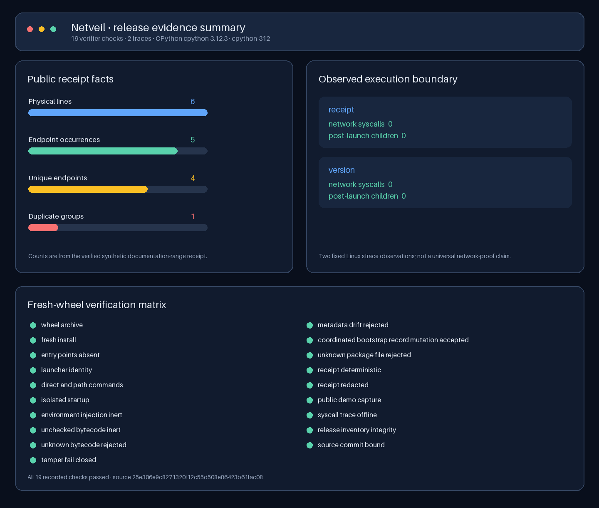

# Netveil

Netveil turns a private local corpus of IP endpoints into a deterministic,
pseudonymized audit receipt without resolving, connecting to, or probing any
endpoint.

The unusual part is not the JSON. The wheel-installed command starts through
an isolated static launcher, binds selected installed files to installer-
derived distribution metadata, source-loads a closed package inventory from
already-pinned bytes, and omits raw endpoints, caller paths, key material, and
unkeyed corpus hashes from its successful receipt and Python-handled Netveil
diagnostics.

> **Status:** 0.3.0 is the hardened repository release represented by this
> tree; no package-index publication is claimed. The guarded command has been
> exercised on CPython 3.12.3 / Linux x86-64. See the exact
> [artifact boundary](docs/artifact-boundary.md) before relying on it.

## What it produces

Input stays local:

```text
# IETF documentation ranges only
192.0.2.10:443
192.0.2.10:443
[2001:db8::10]:8443
```

The public receipt contains fixed-schema counts, runtime semantics, typed
HMAC-SHA256 identifiers for exact source content and repeated endpoint groups,
and a digest of the canonical public report. It does not contain
`192.0.2.10`, `2001:db8::10`, the key, or an ordinary SHA-256 of the input.

Receipt disclosure is still a decision: sizes, category totals, duplicate
equality, and duplicate frequency remain visible. Pseudonymized does not mean
anonymous.



_This chart is generated from the exact successful receipt captured by the
fresh-wheel verifier. The six-line corpus uses only synthetic IETF
documentation ranges; the chart is evidence of the workflow, not a claim about
live infrastructure._

## Installed workflow

Use an exact wheel in a fresh standard POSIX virtual environment. Verify its
published digest through an authenticated channel before installation; the
runtime guard is not a signature.

```bash
WHEEL=dist/netveil_audit-0.3.0-py3-none-any.whl
EXPECTED_SHA256='<digest from the authenticated release manifest>'
printf '%s  %s\n' "$EXPECTED_SHA256" "$WHEEL" \
  | sha256sum --check --strict

python3 -m venv .demo-venv
.demo-venv/bin/python -m pip install --no-index --no-deps "$WHEEL"
.demo-venv/bin/netveil-audit --version
```

Create a synthetic demonstration corpus and a private ephemeral key:

```bash
umask 077

printf '%s\n' \
  '# IETF documentation ranges only' \
  '192.0.2.10:443' \
  '192.0.2.10:443' \
  '[2001:db8::10]:8443' > corpus.txt

.demo-venv/bin/python - <<'PY'
import os
import secrets

descriptor = os.open(
    "receipt.key",
    os.O_WRONLY | os.O_CREAT | os.O_EXCL,
    0o600,
)
with os.fdopen(descriptor, "wb") as stream:
    stream.write(secrets.token_bytes(32))
PY

.demo-venv/bin/netveil-audit \
  receipt corpus.txt \
  --key-file receipt.key > receipt.json
```

The key is exact binary input: do not create a production key with `echo`,
hard-code it, reuse a corpus as a key, or commit it. Netveil requires 32–4096
bytes, effective-user ownership, exactly one hard link, and owner-only
permissions. The complete file and exit-code contract is in
[docs/cli-contract.md](docs/cli-contract.md).



_This is a deterministic rendering of actual stdout from the verified wheel,
not a typed mockup. The same capture is committed as an
[asciinema v2 terminal recording](docs/evidence/cli-session.cast); replay it
with `asciinema play docs/evidence/cli-session.cast`._



_The PNG is rendered from the exact committed terminal cast under the pinned
Pillow runtime. It is a raster evidence view of real CLI output, not an OS
window screenshot and not a hand-authored terminal mockup._

## How the guard works



_Selected launcher flags, parser/CLI bounds, and the closed module inventory
are extracted from source by `tools/render_architecture.py`; the remaining
labels document the reviewed design, and the test suite pins the complete
renderer output._

```text
installed polyglot launcher
  │  /bin/sh -> sibling python -I -E -S -B
  ▼
startup-profile + installed-RECORD drift check
  │  compile checked netveil_bootstrap.py bytes
  ▼
closed package inventory + bounded descriptor reads
  │  compile pinned netveil.* source bytes in memory
  ▼
local corpus + owner-only key
  │  parse -> canonicalize -> aggregate -> domain-separated HMAC
  ▼
canonical pseudonymized receipt on stdout
```



_This once-through animation is generated from the fresh-wheel verification
record. Every frame is bound to the same synthetic receipt and source revision;
it is workflow evidence, not a benchmark or a claim about live endpoints._

The static launcher closes the earlier `PYTHONPATH`, `sitecustomize`, and
unchecked-bootstrap-`pyc` gap of a generated console wrapper. The package
finder rejects unknown `netveil.*` modules and does not execute package
bytecode.

The remaining trust boundary is explicit:

- the installed launcher is already executing before it can check itself;
- `/bin/sh`, the sibling CPython interpreter, stdlib, installer, OS,
  filesystem, standard virtual-environment layout, and installed
  `.dist-info/RECORD` are trusted;
- the installed `RECORD` is mutable, unsigned, and may differ from the wheel
  archive's original record after installer rewrites; coordinated
  code-plus-`RECORD` changes are accepted;
- the file checks are individually race-aware but do not create a
  transactionally atomic snapshot against a hostile concurrent mutator;
- the checks detect uncoordinated artifact drift; they do not prove publisher
  identity, provenance, freshness, or an uncompromised host.

Read [docs/artifact-boundary.md](docs/artifact-boundary.md) for the layer-by-
layer threat model and non-claims.

The receipt does not embed the wheel digest, source commit, distribution
version, or evidence identity. Preserve the fresh-wheel verification manifest
beside any published receipt when artifact provenance matters.

## Privacy protocol

The parser is dependency-free and fail-closed:

- strict UTF-8 and unambiguous IPv4/bracketed-IPv6 endpoint syntax;
- 8 MiB and 100,000-physical-line bounds;
- deterministic canonicalization and duplicate detection;
- explicit address-scope and IANA port-range counts;
- redacted parser failures that retain a bounded code and optional line number,
  not the rejected endpoint.

The report protocol uses separate versioned HMAC domains for source content
and repeated endpoint groups. Key rotation changes both typed identifiers.
Equivalent IPv6 spellings canonicalize before equality grouping. Canonical
JSON is byte-deterministic only for the same exact source bytes, key bytes,
code/artifact identity, and embedded Python runtime profile.

[docs/privacy-protocol.md](docs/privacy-protocol.md) specifies the framing,
domains, schemas, ordering, runtime binding, count semantics, and disclosure
limits.

## Library boundary

Trusted local code can use the parser or report builder directly:

```python
from netveil import build_privacy_receipt, parse_corpus

payload = b"192.0.2.10:443\n[2001:db8::10]:8443\n"
corpus = parse_corpus(payload)
receipt = build_privacy_receipt(
    payload,
    pseudonymization_key=b"\x01" * 32,
)
```

This example key is deterministic test material, not production guidance.
Library calls—including an ordinary `import netveil` from the installed
wheel—do not use the installed-command guard. `Endpoint` and `EndpointCorpus`
models retain raw canonical addresses, and the corpus model retains an unkeyed
source SHA-256. Do not log or publish those objects when the input is
sensitive.

## Developer checks

Editable installation is for development only and is expected to fail the
guarded CLI contract.

```bash
python3 -m venv .venv
.venv/bin/python -m pip install \
  --require-hashes \
  --requirement requirements-ci-py312.lock
.venv/bin/python -m pip install --no-build-isolation --no-deps --editable .

.venv/bin/ruff check .
.venv/bin/ruff format --check .
.venv/bin/mypy
.venv/bin/coverage run -m unittest discover -s tests
.venv/bin/coverage report -m
```

`requirements-dev.txt` is the human-reviewed input list. The committed
`requirements-ci-py312.lock` is the CI installation contract: 14 exact package
pins and 383 SHA-256 file hashes, generated twice and installed with
`--require-hashes` on CPython 3.12.3/Linux. The adjacent provenance JSON binds
the lock generator, source inputs, and validation run; this remains a bounded
environment record, not a universal supply-chain attestation.

The current source gate covers the extensionless launcher, bootstrap, CLI,
parser, models, and privacy protocol at 100% statement and branch coverage.
A separate installed-artifact gate builds no trust from the editable
environment: it accepts an exact wheel, installs it into a fresh venv with
`--no-index --no-deps`, and exercises startup injection, bytecode, tamper,
determinism, and redaction cases.

## Reproducible release evidence



The publication gate requires Git, CPython 3.12, the pinned development
packages above, and Linux `strace`. Run it only from a clean checkout. The
builder enforces a clean Git top-level, exports the exact `HEAD` with
`git archive`, and rejects an output directory inside the source tree.

```bash
set -eu

COMMIT=$(git rev-parse --verify 'HEAD^{commit}')
SOURCE_DATE_EPOCH=$(git show -s --format=%ct "$COMMIT")
OUT="$(dirname "$PWD")/netveil-release-${COMMIT}"
test ! -e "$OUT"

.venv/bin/python tools/build_release.py \
  "$PWD" "$OUT" \
  --source-date-epoch "$SOURCE_DATE_EPOCH" \
  --python "$PWD/.venv/bin/python"

VERIFY_TMP="$OUT/.fresh-wheel-verification.json.tmp"
.venv/bin/python tools/verify_fresh_wheel.py \
  --source-commit "$COMMIT" \
  --inventory "$OUT/release-inventory.json" \
  --sdist "$OUT/netveil_audit-0.3.0.tar.gz" \
  "$OUT/netveil_audit-0.3.0-py3-none-any.whl" > "$VERIFY_TMP"
mv "$VERIFY_TMP" "$OUT/fresh-wheel-verification.json"
```

The verifier reads the actual wheel, sdist, and canonical inventory; installs
the pinned wheel into a fresh no-dependency environment; runs startup,
bytecode, tamper, deterministic-output, redaction, public-demo, and syscall
checks; and emits one path-free canonical JSON line.





_The summary plots recorded facts from one synthetic run. In particular, two
zero-network syscall observations do not prove that every possible execution
can never use a network._

The committed machine-readable manifests record the exact source revision used
for the bundle. All 19 verifier checks passed, both normalized Linux traces
recorded zero network syscalls and zero post-launch child processes, and the
installed launcher and `RECORD` identities were captured. Inspect the canonical
[release inventory](docs/evidence/release-inventory.json), the [fresh-wheel
verification record](docs/evidence/fresh-wheel-verification.json), the [vector
manifest](docs/evidence/visual-manifest.json), and the [raster
manifest](docs/evidence/raster-manifest.json) rather than trusting a rendered
summary alone.

`docs/evidence` is deliberately repository-only. Embedding an inventory that
hashes the sdist inside that same sdist would be self-referential; publish the
evidence beside the release artifacts, not inside them.

To refresh the committed evidence views after a successful exact-commit run:

```bash
mkdir -p docs/evidence
cp -- "$OUT/release-inventory.json" \
  docs/evidence/release-inventory.json
cp -- "$OUT/fresh-wheel-verification.json" \
  docs/evidence/fresh-wheel-verification.json

.venv/bin/python tools/render_evidence.py
.venv/bin/python tools/render_evidence.py --check

.venv/bin/python -m tools.render_raster_evidence
.venv/bin/python -m tools.render_raster_evidence --check
```

Repeat the build into a second nonexistent sibling directory and compare the
wheel, sdist, and inventory bytes when testing build reproducibility.

These JSON files are unsigned consistency and execution evidence, not a
signature or remote attestation. Their trusted computing base includes the
checked-out verifier, Git and `git archive`, CPython, `build`, setuptools,
pip/ensurepip, `strace`, the OS, and filesystem. They cannot prove that the
verifier or host was honest. Publish artifact digests through a separately
authenticated channel. The recorded trace hash covers normalized path-free
facts, not the temporary raw `strace` bytes.

## Deliberate exclusions

Netveil is not a scanner, proxy checker, service-discovery client, reachability
tester, anonymizer, key vault, package signature verifier, sandbox, or remote
attestation system. It never grants permission to test systems you do not own
or lack authorization to assess.

The repository historically contained unverified third-party endpoint lists
collected in 2022. They were removed from the current tree because they had no
adequate provenance or consent. Their presence in Git history is not evidence
that any service is live and not authorization to connect to it.

Use only caller-owned data, explicitly redistributable fixtures, or IETF
documentation ranges in examples and issues. See [SECURITY.md](SECURITY.md)
for disclosure and sensitive-data handling guidance.
The MIT license covers the current Netveil code and documentation authored for
this rehabilitation. It does not assert ownership of, grant rights to, or
relicense the removed historical endpoint lists that remain reachable only in
Git history.

